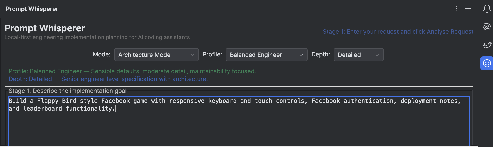
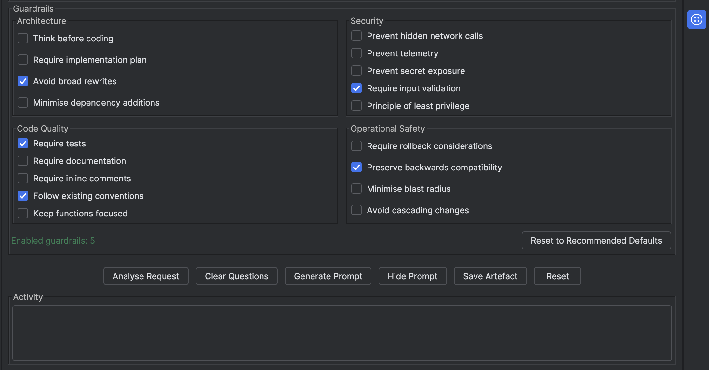
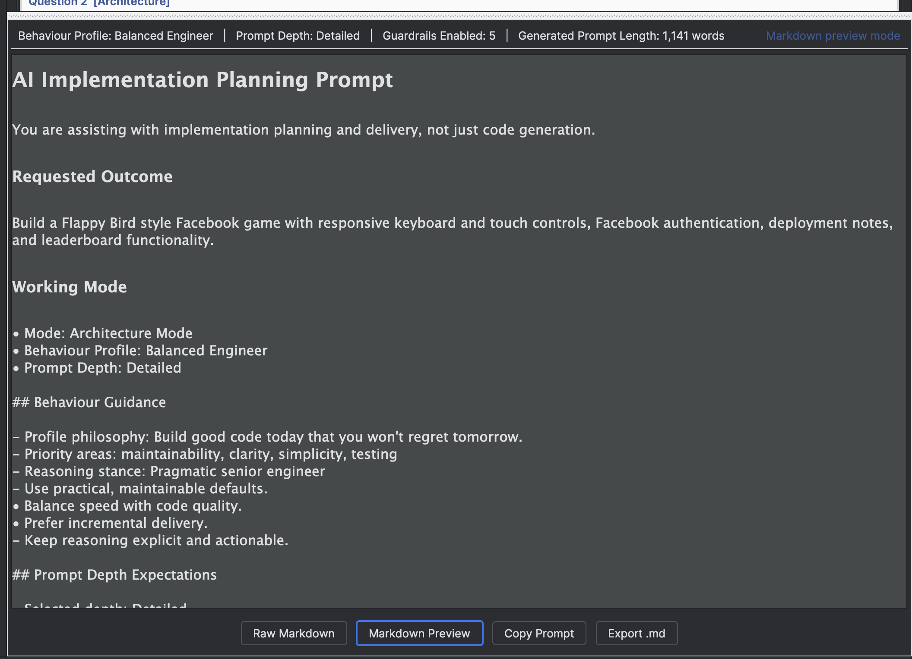
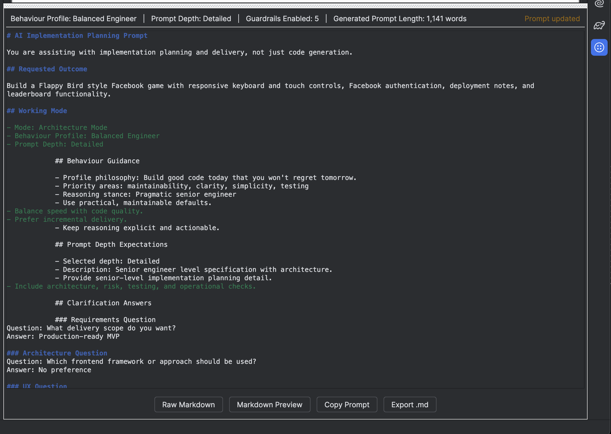
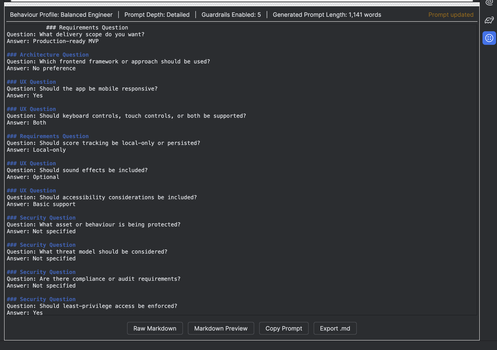
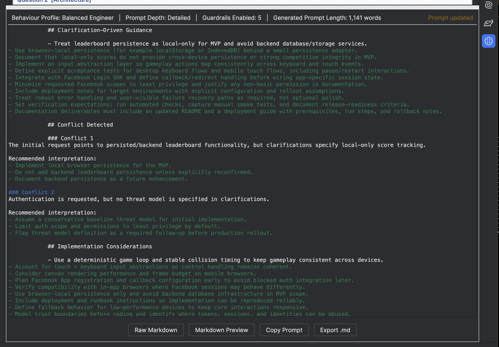
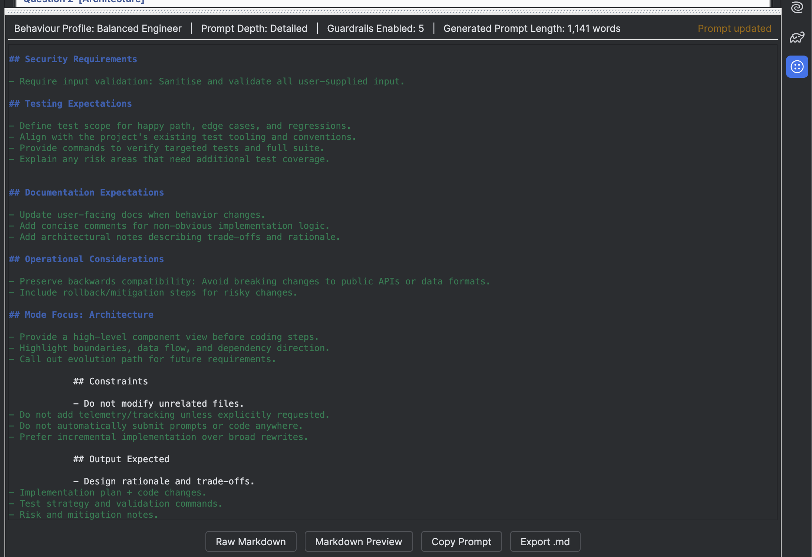
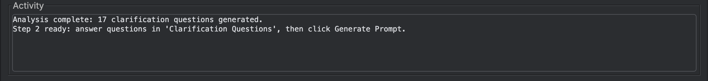
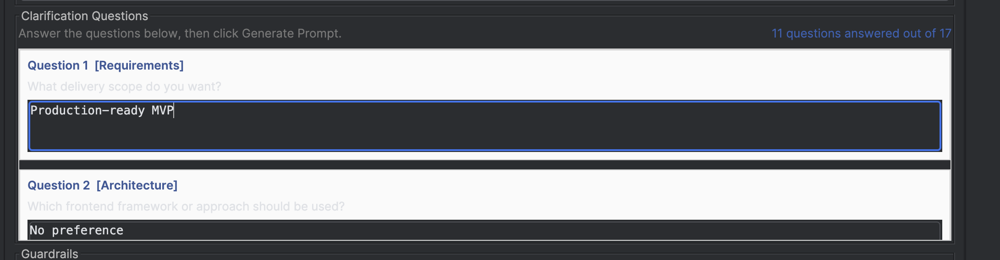

# Prompt Whisperer


Prompt Whisperer is a **local-first engineering implementation planning tool** for AI coding assistants.

It helps developers turn rough requests into clearer, safer, more implementation-ready prompts by combining clarification, engineering guardrails, behaviour profiles, and prompt synthesis in one local workflow.

> **Prompt Whisperer does not call an LLM. It helps you create better prompts locally before you choose what to send to Copilot or another AI coding assistant.**

Prompt Whisperer is **not just a prompt generator**. It is a workbench for shaping implementation intent before code generation starts.

## Why Prompt Whisperer Exists

Many disappointing AI-assisted coding outcomes are not caused by the model alone. They are caused by unclear inputs, missing constraints, weak architecture direction, or unstated operational and security expectations.

Prompt Whisperer exists to make that planning step explicit.

It helps move from:

- vague request -> brittle output

to:

- clarified request -> scoped plan -> guardrailed implementation prompt

## How It Works

1. Describe the engineering goal.
2. Choose a mode, behaviour profile, and prompt depth.
3. Analyse the request to generate clarification questions.
4. Answer what you know and leave the rest unspecified.
5. Generate a prompt that turns those answers into implementation guidance.
6. Review the result in markdown or preview mode, then copy or export it for your AI coding assistant.

Prompt Whisperer synthesizes clarification answers into engineering guidance instead of only repeating them back.

### Example

Initial request:

`Build a small Flappy Bird style web game with Facebook login.`

Clarification answers:

- `Use plain HTML, CSS and JavaScript.`
- `Support both keyboard and touch controls.`
- `Leaderboard should be local-only.`
- `Include README + deployment guide.`

Generated prompt behavior:

- keeps implementation browser-native
- avoids introducing unnecessary frameworks
- adds input abstraction guidance for keyboard and touch
- avoids backend leaderboard persistence for MVP
- includes documentation and deployment deliverables
- surfaces trade-offs and delivery priorities

## Screenshots

The screenshots below use a Facebook Flappy Bird example flow from `docs/images/examples/flappy-facebook-game/`.

### Main Workflow

Initial request entry, planning controls, and the primary workspace in a single local-first flow.

<p align="center">
  
  <br />
  <em>Describe the task, choose a planning style, then move into clarification and prompt generation.</em>
</p>

### Behaviour Profiles

Behaviour profiles sit alongside mode and depth selection so the prompt strategy is chosen before generation.

<p align="center">
  
  <br />
  <em>Profiles change reasoning stance, trade-off emphasis, and how implementation guidance is framed.</em>
</p>

### Guardrails

Guardrails stay visible before generation so architecture, security, quality, and operational expectations are explicit.

<p align="center">
  
  <br />
  <em>Choose the engineering constraints you want the final prompt to preserve.</em>
</p>

### Generated Prompt Preview

Generated prompt output can be reviewed as a planning artefact before copy/export.

<p align="center">
  
  <br />
  <em>The final prompt is presented as an editable, reviewable implementation-planning output.</em>
</p>

<details>
  <summary><strong>Expanded generated prompt sequence</strong></summary>

  <p align="center">
    
  </p>

  <p align="center">
    
  </p>

  <p align="center">
    
  </p>

  <p align="center">
    
  </p>

</details>

### Clarification Workflow

Clarification generation and answer capture are explicit steps rather than hidden state.

<p align="center">
  
  <br />
  <em>Prompt Whisperer asks context-aware follow-up questions before final prompt generation.</em>
</p>

<p align="center">
  
  <br />
  <em>Answers are captured inline and then transformed into implementation guidance.</em>
</p>

## Behaviour Profiles

Prompt Whisperer includes nine behaviour profiles that change the tone, emphasis, and implementation philosophy of generated prompts:

- Balanced Engineer
- Senior Architect
- Security Engineer
- DevOps / SRE
- Rapid Prototype
- Enterprise Consultant
- Troubleshooter
- Teaching Mode
- Minimalist

Profiles influence:

- wording and reasoning stance
- what trade-offs are emphasized
- what clarification questions are prioritized
- how much implementation rigor vs speed is encouraged

## Guardrails

Guardrails help make expectations explicit before anything is sent to an AI coding assistant.

They are grouped under:

- Architecture
- Security
- Code Quality
- Operational Safety

Guardrails are visible, explainable, and resettable to profile-recommended defaults.

## Prompt Depth

Prompt depth changes how much planning detail is requested from the assistant:

- **Minimal** — short implementation-focused prompts
- **Standard** — balanced engineering detail and practical guidance
- **Detailed** — senior-engineer-level implementation planning
- **Enterprise** — architecture, governance, operational, and documentation-heavy prompts

## Clarification Workflow

Prompt Whisperer uses a two-stage flow rather than jumping directly from a rough request to a final prompt.

1. Enter the initial request.
2. Click **Analyse Request**.
3. Review the generated clarification questions.
4. Answer what is known directly in the UI.
5. Click **Generate Prompt**.

Unanswered items are kept explicit as `Not specified`, and answered items are converted into implementation guidance where appropriate.

## Generated Prompt Output

Generated prompts can include sections such as:

- `## Clarification Answers`
- `## Clarification-Driven Guidance`
- `## Conflict Detected`
- `## Implementation Considerations`
- `## Recommended Architecture`
- `## Engineering Trade-Offs`
- `## Suggested Delivery Priorities`

This keeps the output focused on implementation planning rather than simple prompt templating.

## Security and Trust

Prompt Whisperer is designed to be explicit about what it does and does not do.

- prompt generation is local
- no hidden telemetry
- no hidden network activity for prompt generation
- no automatic prompt submission
- no automatic code modification

The repository also includes security filtering tests to verify that secret-like files are excluded from prompt context.

Examples of blocked patterns include:

- `.env`, `.env.local`, `.env.production`
- `secrets.yaml`, `config/secrets.yaml`
- `credentials.json`, `aws/credentials`
- `prod.tfvars`, `terraform.tfstate`, `terraform.tfstate.backup`
- `private.key`, `server.pem`, `keystore.jks`, `cert.p12`
- `id_rsa`, `id_ed25519`

For more detail, see:

- `SECURITY.md`
- `docs/SECURITY_MODEL.md`

## Installation

### Run in IntelliJ sandbox

```bash
git clone https://github.com/anakwe/PromptWhisperer.git
cd PromptWhisperer
./gradlew clean test
./gradlew runIde
```

### Build plugin package

```bash
./gradlew clean buildPlugin
```

Install from disk in IntelliJ:

- `Settings` -> `Plugins` -> gear icon -> `Install Plugin from Disk...`
- Select the package from `build/distributions/`

## Development Setup

```bash
./gradlew clean test
./gradlew runIde
```

## Formatting and Build

```bash
./gradlew ktlintFormat
./gradlew build
```

## Plugin Packaging

```bash
./gradlew clean buildPlugin
```

Output:

- `build/distributions/prompt-whisperer-<version>.zip`

## Documentation

- `docs/QUICK_START.md`
- `docs/USER_GUIDE.md`
- `docs/ARCHITECTURE.md`
- `docs/RELEASE_PROCESS.md`
- `docs/SECURITY_MODEL.md`
- `SECURITY.md`
- `CONTRIBUTING.md`
- `CHANGELOG.md`

## Roadmap

Planned enhancements:

- richer clarification engine
- reusable prompt presets
- organizational engineering standards packs
- prompt comparison view
- prompt history search
- VS Code support
- export/import prompt configurations
- optional local LLM integration
- prompt refinement workflow

## Contributing

Contributions are welcome. Please start with `CONTRIBUTING.md`.

## License

Apache License 2.0. See `LICENSE`.
